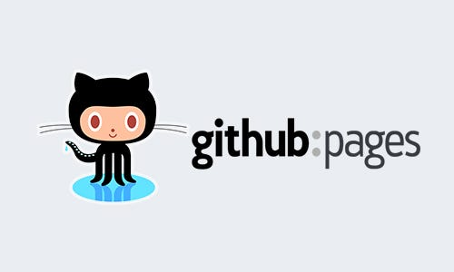

<!-- PROJECT LOGO -->
 

  

  <h3 align="center">Startrepo Don Bosco Haacht</h3>

  

    Gemaakt door Tibo Geeraerts, Ruben Pinxten en Matthias Theys
     
    <a href="https://github.com/tibogeeraerts/training-dbh"><strong>Bekijk de bestanden »</strong></a>
  

## Gebouwd met :

[![Html][Html-logo]][Html-url]
[![Css][css-logo]][css-url]

<!-- Over dit project -->
## Over dit project

Dit project is voor de trainingssessie op Don Bosco Haacht. Deze sessie is ontstaan door een opdracht voor het vak Professional Skills 2.
Tijdens deze sessie geven wij 3 uitleg over hoe de studenten Industrieële ICT een basis website kunnen ontwikkelen en hosten.

(<a href="#readme-top">back to top</a>)

<!-- Stappenplan -->

  
Stappenplan

  <ol>
    <li>Open GitHub in je browser en log in op je account.</li>
    <li>Ga naar de <a href="https://github.com/tibogeeraerts/training-dbh">startrepo</a> en kopieer de URL van de repository.</li>
    <li>Open de terminal op je computer en navigeer naar de map waar je de geclonede repository wilt opslaan.</li>
    <li>Typ het volgende commando in de terminal: 'git clone https://github.com/tibogeeraerts/training-dbh'.</li>
    <li>Wacht tot de repository is gekloond naar je computer. Dit kan even duren, afhankelijk van de grootte van de repository.</li>
    <li>Maak nu een nieuwe repository an op GitHub door naar je profielpagina te gaan en op de knop "New repository" te klikken.</li>
    <li>Geef de nieuwe repository een naam en beschrijving en klik op "Create repository".</li>
    <li>Ga terug naar de terminal en navigeer naar de map war de gekloonde repository zich bevindt.</li>
    <li>Typ het volgende commando in de terminal: 'git remote set-url origin <new-repository-url>. Vervang '<new-repository-url>' door de URL van de nieuwe repository die je zojuist hebt aangemaakt.</li>
    <li>Voer het volgende commando it: 'git add . " om alle bestanden in de repository toe te voegen aan de staging area.</li>
    <li>Voer het volgende commando uit: 'git commit -m "Eerste commit" om de wijzigingen te committen met een commit message.</li>
    <li>Voer het volgende commando it: 'git push origin master" om de wizigingen naar de nieuwe repository te pushen.</li>
  </ol>
  
Gefeliciteerd, je hebt zojuist een GitHub-repository gekloond, en nieuwe repository aangemaakt en de geclonede inhoud naar je eigen repository gepusht!

### HTML code
![html code][html-code]

HTML code uitleg

(<a href="#readme-top">back to top</a>)

### CSS code
![css code][css-code]

CSS code uitleg 

(<a href="#readme-top">back to top</a>)

### Hosting

![hosting uitleg][hosting-screenshot]

Uitleg over gratis hosting

(<a href="#readme-top">back to top</a>)

<!-- CONTACT -->
## Contactgegevens

Tibo Geeraerts - [Tibo Geeraerts](http://geeraertstibo.be/) - r0882113@student.thomasmore.be
 
Ruben Pinxten - [Ruben Pinxten](https://rubenpinxten.com/) - r0887893@student.thomasmore.be
 
Matthias Theys - [Matthias Theys](https://matthiastheys.github.io/) - r0895598@student.thomasmore.be

(<a href="#readme-top">back to top</a>)

<!-- MARKDOWN LINKS & IMAGES -->
[Html-logo]: https://img.shields.io/badge/HTML-E54C21?style=for-the-badge&logo=html5&logoColor=white
[Html-url]: https://www.w3schools.com/html/
[css-logo]: https://img.shields.io/static/v1?style=for-the-badge&message=CSS&color=1572B6&logo=CSS3&logoColor=FFFFFF&label=
[css-url]: https://www.w3schools.com/css/

[html-code]: images/html-code.jpg
[css-code]: images/css-code.jpg
[hosting-screenshot]: images/hosting-screenshot.jpg